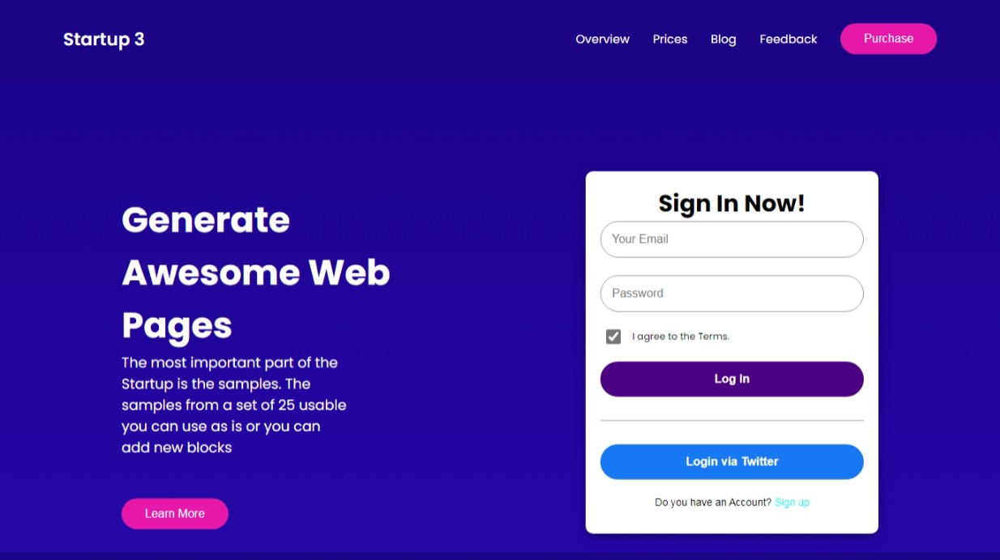

# Rocket Career Product Landing Page Assignment

This is the README file for the assignment you received from Rocket Career to create a landing page for a product website.

## Assignment Overview

creating a landing page for a product website as part of your assignment for Rocket Career. This landing page should effectively promote and showcase the product, providing essential information and engaging visuals to attract potential customers.

## Task List

- [ ] Define the product and its key features.
- [ ] Design the layout and user interface of the landing page.
- [ ] Create visuals, including images and graphics.
- [ ] Implement any necessary HTML/CSS/JavaScript code.
- [ ] Ensure the landing page is mobile-responsive.
- [ ] Test the landing page across different browsers.
- [ ] Prepare for deployment.

## Project Structure

Here's a suggested project structure for your assignment:

project-root/
- index.html # Landing page HTML
- styles.css # CSS styles
- script.js # JavaScript (if needed)
- images/ # Image folder
- README.md # This file

## Getting Started

To get started with this assignment, follow these steps:

1. Clone this repository to your local machine:

2. Begin working on the assignment tasks, making sure to update the project structure accordingly.

## Demo
[]

## Live
[Landing Page](https://frontend-dev-assignment.vercel.app/)

